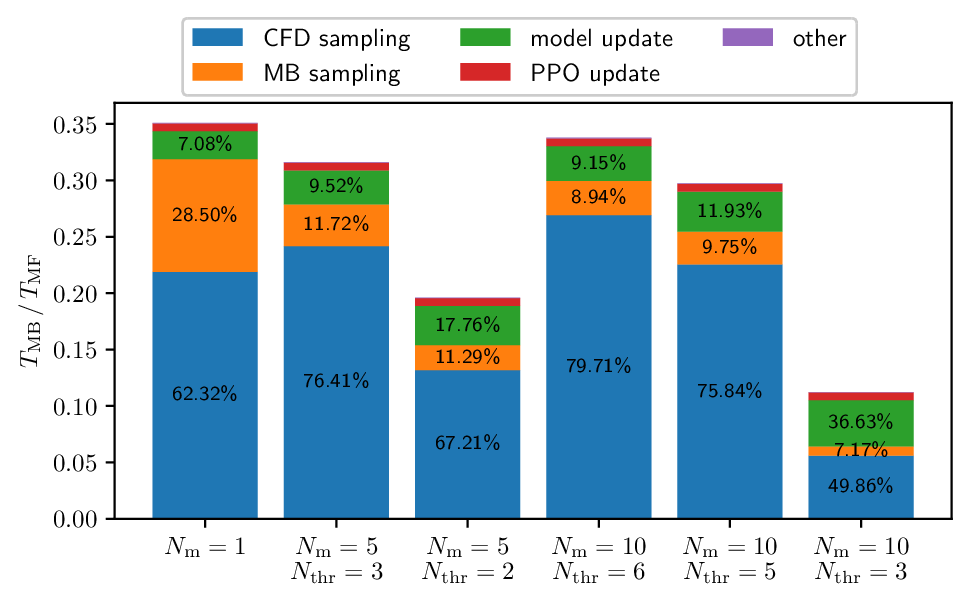

# Model-based deep reinforcement learning for accelerated learning from flow simulations

## Introduction

This code repository accompanies the article [Model-based deep reinforcement learning for accelerated learning from flow simulations](https://arxiv.org/abs/2402.16543). For referencing, please use:
```
@misc{weiner2024,
      title={Model-based deep reinforcement learning for accelerated learning from flow simulations}, 
      author={Andre Weiner and Janis Geise},
      year={2024},
      eprint={2402.16543},
      archivePrefix={arXiv},
      primaryClass={physics.flu-dyn}
}
```
Deep reinforcement learning (DRL) is a viable approach for solving closed-loop active flow control problems. Learning control laws from simulations has several advantages, e.g., the possibility to perform end-to-end optimization of the entire control system (sensors, actuators, control law). However, learning from simulations is also very expensive and time consuming. In this work, we demonstrate the benefits of model-based DRL (MBDRL). In MBDRL, surrogate models are created on the fly and allow to replace some of the expensive simulations.

## Results sneak peak

The following figure show the time spent on different parts of the MBDRL training for the common cylinder flow benchmark. The timings are normalized by the total training time $T_\mathrm{MF}$ of model-free DRL. We explored learning from a single environment model and also learning from an ensemble of $N_\mathrm{m}$ surrogate models. Learning from an ensemble  improves robustness and enables uncertainty quantification. The threshold value $N_\mathrm{thr}$ is a hyperparameter to control the switching between learning from surrogate models and learning from simulations. Low values of $N_\mathrm{thr}$ exploit the surrogate models more at the potential risk of reduced robustness. Depending on the chosen settings, the training time can be reduced by $65-90\%$. For a more detailed discussion, refer to the manuscript.




## Repository structure and dependencies

### Dependencies

The DRL logic and orchestration of simulations are implemented in the [drlFoam](https://github.com/OFDataCommittee/drlfoam/tree/main) package. The model-based extension is only available in a dedicated [fork](https://github.com/JanisGeise/drlfoam/tree/mb_drl). Refer to the fork's README for installation instructions. The script `run_job.sh` demonstrates how to start a training on a cluster with SLURM scheduler. The script `submit_jobs.sh` may be used to perform multiple trainings. The scripts accept command line parameters, which are documented in the scripts.

### Results and analyses

The results of all training can be downloaded [here](ADD LINK HERE). Extract the archive in the repository's top-level folder by running `tar xzf data.tar.gz`. The scripts to process and visualize the results are available under *post_processing*. Run the scripts from within the subfolder, e.g.:
```
# starting from the repositories top-level folder
cd post_processing
# run a script
python3 plot_execution_times_of_training.py
# start a notebook, then open final_plots.ipynb
jupyter-lab
```

The following scripts are available:
- `final_plots.ipynb`: Jupyter notebook used to create the final visualizations in the manuscript
- `plot_results_cylinder.py`: plots mean rewards, trajectories of selected episodes, comparisons of final policies for the cylinder flow
- `plot_results_pinball.py`: analogous to `plot_results_cylinder.py` for the fluidic pinball
- `get_mean_cl_cd_final_results.py`: computes mean and standard deviation of force coefficients for each policy after validation runs
- `plot_execution_times_of_training.py`: plots a bar chart of the composition of the overall execution times w.r.t. the MF training
- `plot_amount_discarded_trajectories.py`: plots the amount of discarded (invalid) trajectories encountered in each MB training
- `compare_pressure_fields.py`: plot mean pressure and pressure fluctuations for the cylinder flow (with and without control)
- `plot_numerical_setup.py`: creates sketches of the simulation setups
- `ppo_data_loader.py`: loads and aggregates PPO training data (rewards, states, actions); required by other scripts

In case of doubt, feel free to open an issue in this repository

## Acknowledgement

The authors gratefully acknowledge the Deutsche Forschungsgemeinschaft DFG (German Research Foundation) for funding this work in the framework of the research unit FOR 2895 under the grant WE 6948/1-1.
